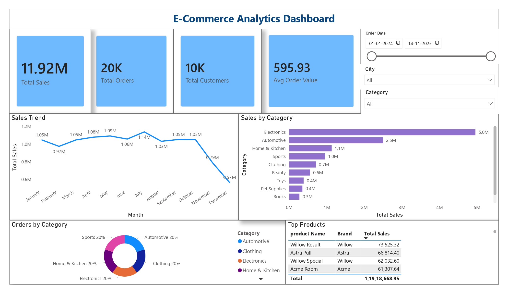

# 🛒 E-Commerce Analytics Dashboard

## 📌 Project Overview

This project focuses on analyzing e-commerce business performance using Python, SQL, and Power BI. The objective of this project is to extract meaningful business insights from raw transactional data and visualize them through an interactive dashboard.

The project demonstrates:

Data Cleaning & Analysis
Exploratory Data Analysis (EDA)
SQL-based Business Insights
Interactive Dashboard Development
KPI Monitoring & Visualization

---

## 📊 Dataset Source

The dataset used in this project was obtained from Kaggle:

https://www.kaggle.com/datasets/abhayayare/e-commerce-dataset

The dataset consists of multiple related tables representing different aspects of an online shopping platform.

---

## Dataset Summary

The analysis was performed across 6 relational datasets containing approximately 170K records.

| Table | Records |
|---------|---------:|
| Events | 80K+ |
| Order Items | 43K+ |
| Orders | 20K+ |
| Reviews | 15K+ |
| Users | 10K+ |
| Products | 2K+ |

---

## 🚀 Tech Stack

### Data Analysis
- Python
- Pandas

### SQL & Data Warehousing
- SQL
- Google BigQuery

### Visualization
- Power BI
- Matplotlib
- Seaborn
---

## Project Workflow

1. Data loading and exploration
2. Data cleaning and preprocessing
3. SQL analysis for business metrics
4. Exploratory data analysis using Python
5. Visualization of trends and patterns
6. Extraction of key business insights

---

## Analysis Performed

### Sales Analysis
- Total Revenue Analysis
- Average Order Value (AOV)
- Monthly Order Trend Analysis
- Order Status Distribution

### Product Analytics
- Top Selling Products
- Revenue by Category
- Revenue by Brand
- Product Rating Analysis
- Product Rating vs Sales Analysis

### Customer Analytics
- Customer Purchase Frequency
- Top Customers by Spending
- Customer Segmentation (Low, Medium, High Value)
- City-wise Customer Distribution

### User Behavior Analytics
- User Engagement Analysis
- Event Distribution Analysis
- Funnel Analysis (Views → Cart)

### Review Analytics
- Rating Distribution
- Average Product Ratings

---

## Dashboard Preview

## Python Visualizations

### Monthly Order Trend

### Revenue by Category

---

# 📌 Key Metrics

- **Total Sales:** 11.92M
- **Total Orders:** 20K
- **Total Customers:** 10K
- **Average Order Value:** 595.93

---

# 📊 Dashboard Features

- Monthly Sales Trend Analysis
- Category-wise Revenue Analysis
- Top Selling Products
- Customer Insights
- KPI Monitoring
- Interactive Filters & Slicers
- Business Performance Monitoring

---

# 🔍 Analysis Performed

## Python Analysis
- Data Cleaning
- Exploratory Data Analysis (EDA)
- Sales Analysis
- Customer Behavior Analysis
- Product Performance Analysis

## SQL Analysis
- Revenue Analysis
- Category-wise Sales Analysis
- Customer Spending Analysis
- Top Product Analysis
- KPI Calculations

## Power BI Dashboard
- KPI Visualization
- Interactive Dashboard Creation
- Dynamic Filtering
- Business Insight Reporting

---

# 📈 Key Insights

- Electronics generated the highest revenue among all product categories.
- A small group of high-value customers contributed a significant share of total revenue.
- Customer purchase frequency analysis highlighted repeat buying patterns.
- Product ratings showed variations across categories and brands.
- User engagement analysis revealed differences between product views and cart activities.

---

# 💡 Skills Demonstrated

- Data Analysis
- Data Visualization
- Business Intelligence
- SQL Querying
- Dashboard Development
- Exploratory Data Analysis
- KPI Reporting
- Data Cleaning & Preprocessing

---

# 🎯 Conclusion

This project demonstrates an end-to-end data analytics workflow using Python, SQL, and Power BI to transform raw e-commerce data into meaningful business insights and interactive visualizations.
